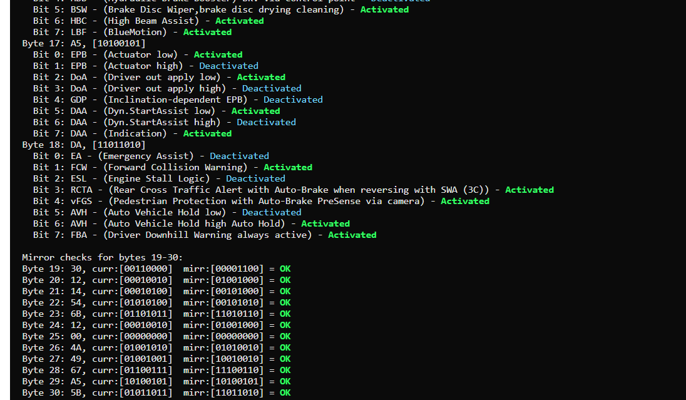

# ESP Long Code Decoder

A web-based tool for decoding and analyzing long code strings (e.g., automotive ECU configuration codes).
The application is built with **FastAPI**, runs in Docker, and includes a simple web interface with colored bit-by-bit decoding.

---

## ✨ Features

- Decode and analyze long coding strings (hexadecimal, even-length,)
- Visualize bit-level flags and related features
- Color-coded output (Activated/Deactivated/Unknown)
- Checks mirrored bytes for correct coding
- Download decoded results in **TXT** or **HTML** format
- Ready for reverse proxy with **Nginx**

## Support brand
Audi 2016 >=
---

## 🖼 Screenshots

    

---

## 🛠 Tech stack

- [FastAPI](https://fastapi.tiangolo.com/) – web framework
- [Jinja2](https://jinja.palletsprojects.com/) – templates
- [uv](https://docs.astral.sh/uv/) – fast package manager for Python
- [Gunicorn + Uvicorn worker](https://www.uvicorn.org/) – production server

---

## LICENSE
GNU GPL v3.0
